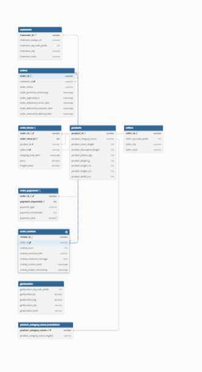
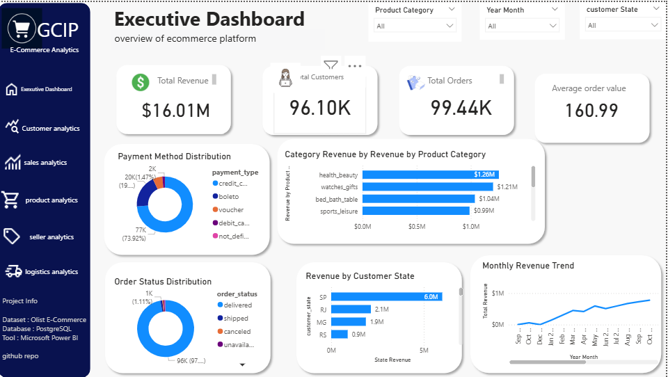
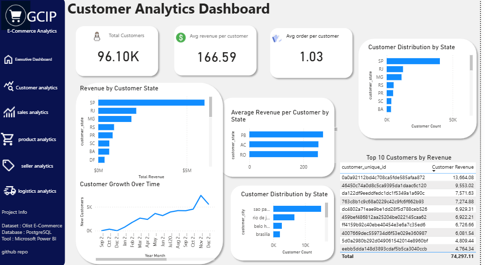
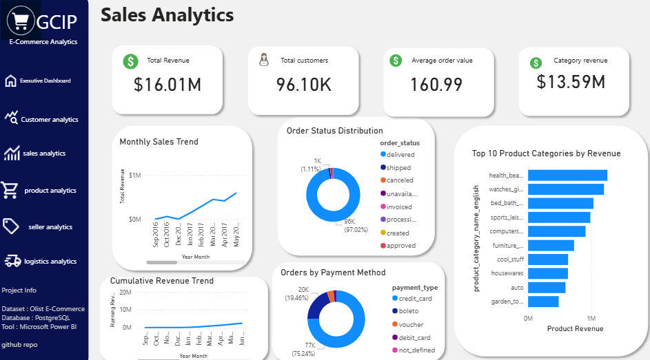
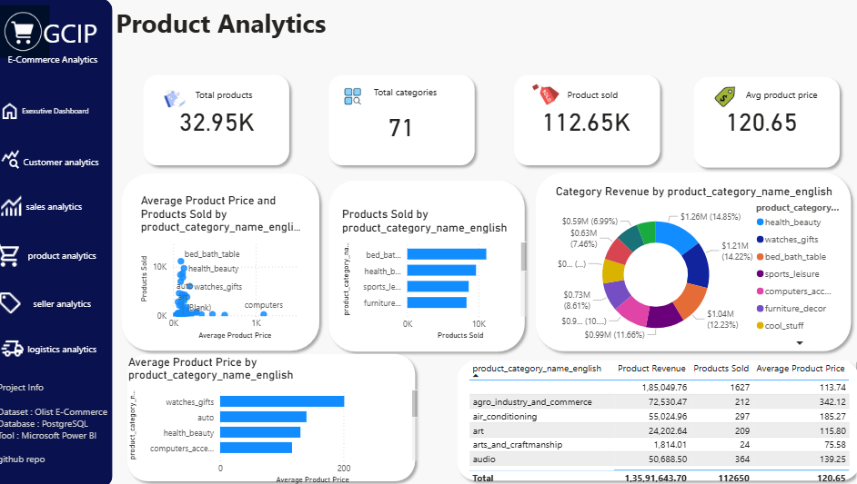
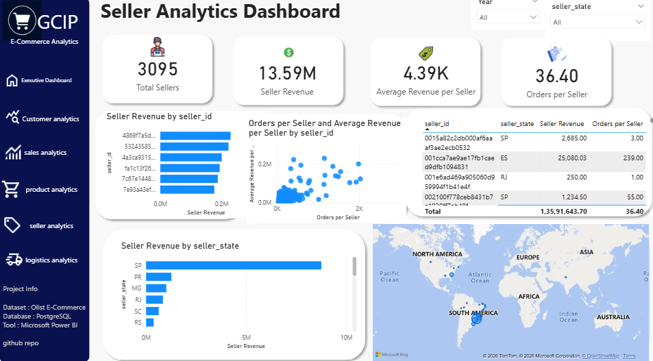
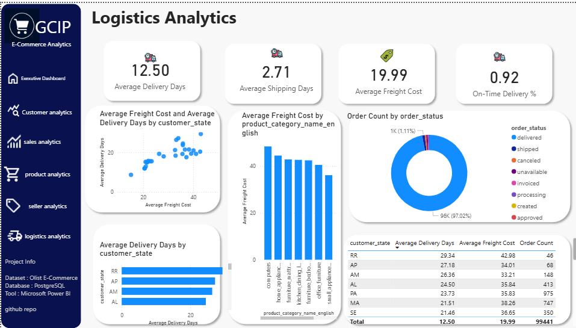

# Global Commerce Intelligence Platform (GCIP)

## Overview

Global Commerce Intelligence Platform (GCIP) is an end-to-end business intelligence solution developed to analyze e-commerce operations using SQL, Python, PostgreSQL, and Power BI.

The project integrates data engineering, exploratory data analysis, business analytics, and interactive dashboard development to transform raw transactional data into actionable business insights for decision-makers.

---

## Business Problem

E-commerce businesses generate large volumes of transactional data across customers, products, sellers, payments, logistics, and reviews.

Without centralized analytics, it becomes difficult to answer business-critical questions such as:

- Which products generate the highest revenue?
- Which customer segments contribute most to sales?
- Which sellers perform best?
- How efficient is the logistics process?
- Which payment methods are most frequently used?
- What business trends are emerging over time?

GCIP addresses these challenges by building an interactive analytics platform capable of monitoring key business metrics and supporting data-driven decision making.

---

## Objectives

- Build a normalized relational database in PostgreSQL.
- Perform exploratory data analysis using Python.
- Execute advanced SQL analysis to answer business questions.
- Develop interactive Power BI dashboards for business stakeholders.
- Present actionable insights through visual analytics.

---

## Dataset

**Source:** Olist Brazilian E-Commerce Public Dataset

The dataset includes information related to:

- Customers
- Orders
- Order Items
- Products
- Sellers
- Payments
- Reviews
- Geolocation
- Product Categories

---

## Tech Stack

| Category | Technologies |
|-----------|--------------|
| Database | PostgreSQL |
| Query Language | SQL |
| Programming | Python |
| Libraries | Pandas, NumPy, Matplotlib |
| Visualization | Power BI |
| Version Control | Git & GitHub |

---

## Project Workflow

```
Data Collection
        │
        ▼
PostgreSQL Database
        │
        ▼
SQL Analysis
        │
        ▼
Python EDA
        │
        ▼
Power BI Dashboard
        │
        ▼
Business Insights
```

---

## Database Design

The database consists of multiple normalized tables connected through primary and foreign keys.

Main entities include:

- Customers
- Orders
- Order Items
- Products
- Sellers
- Payments
- Reviews
- Product Category Translation

The schema was designed to minimize redundancy while supporting efficient analytical queries.


---

## SQL Analysis

Performed advanced SQL analysis using:

- Common Table Expressions (CTEs)
- Window Functions
- Aggregate Functions
- Joins
- Subqueries
- Group By
- Ranking Functions

Business questions answered include:

- Monthly revenue trends
- Top-selling products
- Seller performance
- Customer purchasing behavior
- Payment method analysis
- Revenue by state
- Product category analysis

---

## Python Exploratory Data Analysis

Performed comprehensive exploratory data analysis including:

- Missing value analysis
- Duplicate detection
- Data type validation
- Outlier detection
- Revenue distribution
- Customer analysis
- Product analysis
- Trend analysis
- Feature engineering

Libraries used:

- Pandas
- NumPy
- Matplotlib

---

## Power BI Dashboards

### Executive Dashboard

Key Metrics

- Total Revenue
- Total Customers
- Total Orders
- Average Order Value
- Revenue Trend
- Revenue by Category
- Payment Method Distribution
- Order Status Distribution

---

### Customer Analytics

- Customer Distribution
- Revenue by State
- Customer Growth
- Top Customers
- Average Revenue per Customer

---

### Sales Analytics

- Monthly Sales Trend
- Running Revenue
- Month-over-Month Growth
- Product Category Revenue
- Payment Analysis

---

### Product Analytics

- Product Performance
- Product Categories
- Average Product Price
- Products Sold
- Category Revenue Share

---

### Seller Analytics

- Seller Revenue
- Orders per Seller
- Revenue by Seller State
- Top Sellers
- Seller Performance Analysis

---

### Logistics Analytics

- Delivery Performance
- Shipping Time
- Freight Cost
- On-Time Delivery
- Delivery Status Analysis

---

## Key Performance Indicators

The dashboard monitors multiple business KPIs including:

- Total Revenue
- Total Orders
- Total Customers
- Average Order Value
- Product Revenue
- Category Revenue
- Seller Revenue
- Average Revenue per Customer
- Orders per Seller
- Average Delivery Days
- Average Shipping Days
- Average Freight Cost
- On-Time Delivery Percentage
- Month-over-Month Revenue Growth

---

## Business Insights

Examples of insights generated through the platform include:

- High-performing product categories
- Revenue contribution by region
- Customer purchasing patterns
- Seller performance comparison
- Delivery efficiency trends
- Payment method preferences
- Seasonal sales trends
- Logistics performance metrics

---

## Repository Structure

```
GCIP/
│
├── Dashboard/
│   └── GCIP.pbix
│
├── SQL/
│   ├── schema.sql
│   ├── analysis_queries.sql
│
├── Python/
│   ├── eda.ipynb
│   └── requirements.txt
│
├── Images/
│   ├── executive_dashboard.png
│   ├── customer_analytics.png
│   ├── sales_analytics.png
│   ├── product_analytics.png
│   ├── seller_analytics.png
│   └── logistics_analytics.png
│
└── README.md
```

---

## Dashboard Preview

### Executive Dashboard



---

### Customer Analytics




---

### Sales Analytics



---

### Product Analytics



---

### Seller Analytics



---

### Logistics Analytics


---

## Skills Demonstrated

- Relational Database Design
- SQL Query Optimization
- Data Cleaning
- Exploratory Data Analysis
- Business Intelligence
- Data Visualization
- Dashboard Development
- KPI Development
- Data Modeling
- DAX
- Business Analytics

---

## Future Improvements

Future versions of GCIP may include:

- Sales forecasting using machine learning
- Customer segmentation
- Demand prediction
- Inventory optimization
- Real-time dashboard integration
- Automated reporting
- Power BI Service deployment
- Role-level security implementation

---

## Author

**Van**

